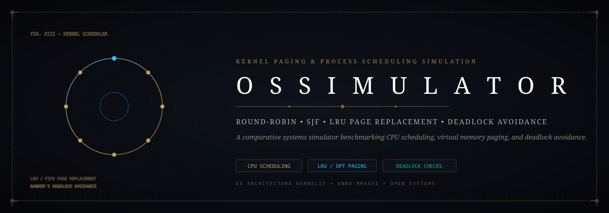
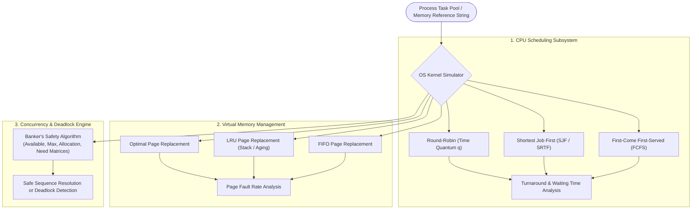

<div align="center">



# 🖥️ OS Simulator: Kernel Paging & Process Scheduling Suite
### *Comparative Systems Benchmarks, LRU/FIFO Page Replacement & Banker's Deadlock Avoidance*

[](https://github.com/Jaswanth1902/OS)
[](https://github.com/Jaswanth1902/OS)
[](https://github.com/Jaswanth1902/OS)
[](https://github.com/Jaswanth1902/OS)
[](LICENSE)

*A comprehensive systems simulation workbench modeling operating system kernel mechanics, CPU scheduling efficiencies, and virtual memory page fault curves.*

</div>

---

## ⚡ The Architectural Vision

Understanding low-level operating system scheduling and memory management trade-offs requires empirical simulation rather than theoretical abstraction. 

**OS Simulator** delivers an interactive systems benchmark evaluating classic kernel algorithms under deterministic workloads:
- **CPU Scheduling Algorithms**: First-Come First-Served (FCFS), Shortest Job First (SJF), Round-Robin (RR) with dynamic quantum slicing, and Priority Preemptive scheduling.
- **Virtual Memory Page Replacement**: Least Recently Used (LRU), First-In First-Out (FIFO), and Optimal (OPT) page replacement algorithms comparing empirical page fault rates and Belady's Anomaly.
- **Deadlock Avoidance**: Banker's Algorithm safety and resource-request state machine verifying safe execution sequences.

---

## 🏗️ Kernel Simulation Architecture



---

## 🧩 Antigravity Skills & Tooling

- **`performance-profiling`**: Microsecond turnaround comparison across CPU scheduling algorithms.
- **`systematic-debugging`**: Edge-case testing of zero-quantum and circular-wait deadlock scenarios.
- **`clean-code`**: Strict decoupling of process descriptors (`PCB`) from queue traversal logic.

---

## 🚀 Quickstart

```bash
# Compile CPU scheduler suite
gcc -O2 -o scheduler cpu_scheduling.c
./scheduler

# Run memory paging benchmarks
gcc -O2 -o paging page_replacement.c
./paging
```

---

## 📄 License

Distributed under the [MIT License](LICENSE). Maintained by [Jaswanth Reddy](https://github.com/Jaswanth1902) — *Passionate learner & creative problem solver learning from and giving back to the open-source community.*
